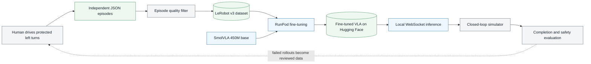

# SmolVLA for Autonomous Left Turns

This repository pairs a Three.js driving simulator with a focused vision-language-action policy. The current experiment has one job: follow a natural-language instruction and complete the protected left turn in the simulator.


The policy is fine-tuned from Hugging Face's open [`lerobot/smolvla_base`](https://huggingface.co/lerobot/smolvla_base) checkpoint. SmolVLA reads the front camera, vehicle state, and instruction, then produces a chunk of target-speed and target-steering actions. A deterministic low-level controller turns those targets into throttle and brake commands. The implementation follows the official [LeRobot SmolVLA workflow](https://huggingface.co/docs/lerobot/smolvla).

## Current status

| Part | Status |
| --- | --- |
| Three.js driving simulator | Working |
| Automatic human episode saving | Working |
| Legacy raw-pedal left-turn demonstrations | 127 clean episodes, retained separately |
| Fresh target-action human collection | 204 curated episodes, 39,417 frames |
| LeRobot v3 dataset | [Published on Hugging Face](https://huggingface.co/datasets/Mayank022/urban-vla-left-turn-cruise-human) |
| SmolVLA fine-tuning on RunPod | Ready, not launched from this revision |
| Held-out offline evaluation and plots | Implemented |
| Browser WebSocket inference | Implemented |
| Closed-loop checkpoint evaluation | Waiting for the new checkpoint |

The earlier 127-episode dataset remains a reference, but the converter rejects it because it encodes raw pedals and overwhelmingly contains full-throttle driving. The new release contains only `vla-urban-4` target-speed and target-steering demonstrations. Keeping the contracts separate prevents normalization statistics and action semantics from being mixed.

## Project flow



## Policy contract

Every training frame and live inference request uses the same fields:

```text
camera:       128 x 128 front RGB image
state:        [speed_mps, steering, previous_target_speed_mps, previous_target_steering]
instruction:  "Proceed through the city and make the protected left turn at the main intersection."
action:       [target_speed_mps, target_steering]
rate:         10 Hz
```

The raw recorder stores speed normalized to the simulator's 24 m/s limit. The converter restores metres per second before writing `observation.state`; this keeps training aligned with the browser's live state. Raw throttle and brake are retained only for diagnostics. Each frame also records route progress, signed lateral error, and heading error for dataset review. The model predicts 20 future targets; live inference executes one target before replanning from a new image.

Only the front camera is used. The bird's-eye image remains in the raw recording for inspection but is intentionally excluded from training because it is not an onboard sensor and the live policy should not depend on it.

## Dataset selection

The fresh collection lives in the repository's sibling `../left-turn-target/` folder; the raw files remain untouched. The converter reviewed all 322 independent `human-*.json` episodes and accepted 204 episodes with 39,417 frames and 152 unique simulator seeds. It rejected 118 episodes automatically rather than requiring manual sorting.

The default gates require the `vla-urban-4` schema, `target_speed_steering` actions, 128 x 128 images, at least 60 frames, at least 95% route progress, no collision or off-route flag, no exact duplicate, final lateral error no greater than 2 m, final heading error no greater than 0.15 rad, and no more than 20 stopped frames. The converter places 21 seed-disjoint episodes at the end of the dataset for LeRobot's 10% holdout, preventing the same simulator seed from appearing in training and validation.

Inspect the selection without writing anything:

```bash
cd vla_training
python3 convert_dataset.py --dry-run
```

Create the LeRobot dataset and publish it:

```bash
python3 -m venv .venv
source .venv/bin/activate
python -m pip install --upgrade pip setuptools wheel
python -m pip install -e .

python convert_dataset.py \
  --overwrite \
  --push-to-hub \
  --repo-id Mayank022/urban-vla-left-turn-cruise-human
```

The generated dataset is written to `vla_training/data/left-turn-cruise-lerobot/`, which is ignored by Git. Its `conversion_report.json` records every accepted and rejected source episode. The public release is [`Mayank022/urban-vla-left-turn-cruise-human`](https://huggingface.co/datasets/Mayank022/urban-vla-left-turn-cruise-human).

## Run the simulator

Requirements are Node.js 22 or newer and a current Chrome or Chromium browser.

```bash
npm install
npm run dev
```

Open the URL printed by Vite, normally `http://localhost:5173`. Click **Collect**, choose the sibling `left-turn-target` folder once, and drive. Collection mode locks the protected-left-turn task to a clear, low-traffic, 128 x 128 preset. It runs the simulation clock at 2x so a demonstration takes about half the wall-clock time, while the recorded target speeds, vehicle dynamics, timestamps, and 10 Hz sample rate remain in normal simulated time. Inference and ordinary driving remain at 1x. The traffic signal stays green for this protected movement. A valid route saves one independent JSON episode and resets the simulator with the next seed.

Collection mode does not repair a failed trajectory. A collision or severe route departure stops the attempt, clears its buffered frames and video, and returns the car to the original start. It never teleports the car forward on the route. A drive is saved only when it contains at least 80 samples and reaches the destination aligned with the highlighted exit lane.

The manual controls are designed around the same action chunks the VLA learns:

| Input | Behavior |
| --- | --- |
| Tap `Up` or `W` once | Latch cruise at `24 m/s` |
| Hold `Left` or `A` | Steer left smoothly and lower the target to `18 m/s` |
| Hold `Right` or `D` | Steer right with matching intensity and lower the target to `18 m/s` |
| Release Left or Right | Recenter steering automatically |
| Tap `Down` or `S` once | Smoothly stop without reversing |
| Hold `Space` | Emergency stop |

The **Collect** preset uses lower `12 m/s` cruise and `8 m/s` turn targets; the faster values above remain available during ordinary manual driving. For a clean left-turn demonstration, tap Up once, stay centered on the approach, hold Left before the corner begins, and release it as the car aligns with the destination road. Do not pulse Up or hold full throttle; the speed controller handles acceleration and turn speed.

## Fine-tune on RunPod

An RTX PRO 6000 with 96 GB VRAM is more than sufficient for the default batch size of 32. The vision encoder is unfrozen because simulated road imagery differs sharply from SmolVLA's robot-manipulation pretraining data.

On a fresh RunPod Pod:

```bash
cd /workspace
git clone https://github.com/Mayankpratapsingh022/Action_Chunking_Transformer_Autonomous_Driving.git
cd Action_Chunking_Transformer_Autonomous_Driving/vla_training

./scripts/setup_runpod.sh
printf '%s\n' 'HF_TOKEN=hf_your_write_token' > .env
./scripts/start_runpod_tmux.sh
```

Monitor it from the Pod:

```bash
tmux attach -t smolvla-left-turn
```

Or follow the persistent log from another shell:

```bash
tail -F /workspace/vla-driving/logs/smolvla-left-turn-v2-launcher.log
```

The default run uses 20,000 steps, a batch size of 32, a 10% episode-level validation split, validation every 1,000 steps, and checkpoints every 2,000 steps. Restarting the same command resumes from `checkpoints/last` automatically.

The final model is published to `Mayank022/urban-vla-left-turn-smolvla-v2`. Training configuration, processor statistics, evaluation metrics, plots, and the full log are uploaded with it.

See [vla_training/README.md](vla_training/README.md) for dry runs, overrides, resume behavior, and artifact paths.

## Run the fine-tuned model

Create the Python environment once:

```bash
cd vla_training
python3 -m venv .venv
source .venv/bin/activate
python -m pip install -e .
python scripts/download_model.py
cd ..
```

Start inference in one terminal:

```bash
npm run inference -- --model-path vla_training/artifacts/smolvla-left-turn-v2 --action-steps 1
```

Start Vite in another:

```bash
npm run dev
```

Open the simulator and press `I`. The server uses CUDA when available, then Apple MPS, then CPU. It rejects instructions other than the protected left turn because this checkpoint is deliberately single-task.

The readiness endpoint is [`http://localhost:8000/health`](http://localhost:8000/health). The server verifies the checkpoint's learned normalization tensors, negotiates the legacy three-control or current two-target action contract, and replans after one action by default so a queued chunk cannot delay the turn. Legacy checkpoints are adapted from their original positive-left steering convention to the simulator's current negative-left convention at the server boundary. With both services running, `npm run smoke:inference` checks the socket and one real prediction. `npm run eval:closed-loop` also requires the vehicle to move.

## Evaluation

The training run measures held-out flow-matching loss. After training, `evaluate.py` replays the held-out episodes through the final policy and saves:

- target-speed and target-steering MAE and RMSE
- moving-target precision, recall, and F1
- steering-direction accuracy during active turns
- per-episode error
- prediction scatter and action-trace plots

These are open-loop checks. The real acceptance test is closed-loop: route completion, collisions, off-route time, control smoothness, and repeated success on unseen seeds. A checkpoint should not be called good solely because its offline MAE is low.

## Repository structure

```text
.
|-- src/                         # Simulator, traffic, recorder, HUD, inference client
|-- scripts/                     # Simulator checks and dataset collection tools
|-- datasets/                    # Automated expert dataset workspace
|-- vla_training/
|   |-- configs/left_turn.json   # Fine-tuning defaults
|   |-- src/left_turn_vla/       # Conversion, commands, metrics, model adapter
|   |-- tests/                   # CPU tests without downloading model weights
|   |-- convert_dataset.py       # Human JSON to LeRobot v3
|   |-- train.py                 # Official LeRobot trainer wrapper
|   |-- evaluate.py              # Held-out action evaluation and plots
|   |-- inference_server.py      # Browser WebSocket server
|   `-- runpod_main.py           # RunPod entrypoint
|-- docs/images/
|-- DATASET_COLLECTION.md
`-- package.json
```

## Verification

```bash
npm run check
npm run smoke
npm run audit

cd vla_training
PYTHONPATH=src python -m pytest
python convert_dataset.py --dry-run
python train.py --dry-run
```

No GPU training is started by these commands.

## Safety

This is a synthetic simulator experiment. The vehicle dynamics, camera images, traffic, and demonstrations do not represent the range of conditions on public roads. Do not connect this policy to a real vehicle.
